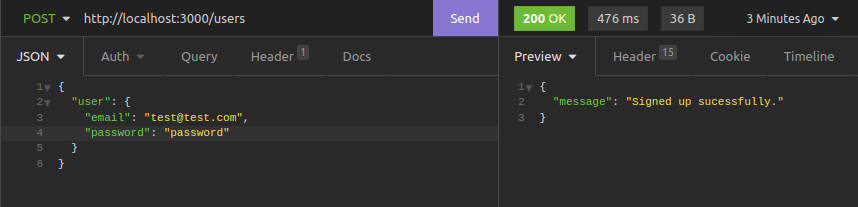
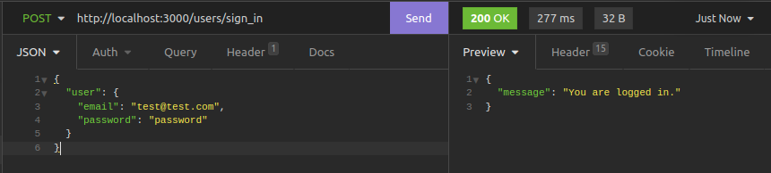
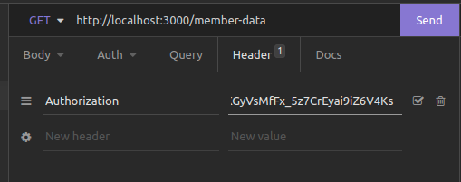
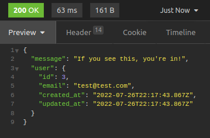

# devise jwt app for rails 7

<font size="4">Today we’ll walk through building a Rails backend using Devise-JWT which allows users to log in, access endpoints requiring authentication, and log out.</font>

### Setup

Create a rails app from the command line.

```console
$ rails new devise-jwt-app -T -d postgresql --api
$ cd devise-jwt-app
```

Add devise, devise-jwt and rack-cors to the Gemfile.

```ruby
gem 'devise'
gem 'devise-jwt'
gem 'rack-cors'
```

Run bundle to install them.

```ruby
$ bundle install
```

configure the cors file to allow all Authorization headers.

`config/initializers/cors.rb`

```ruby
Rails.application.config.middleware.insert_before 0, Rack::Cors do
  allow do
    origins '*'
    resource(
     '*',
     headers: :any,
     expose: ["Authorization"],
     methods: [:get, :patch, :put, :delete, :post, :options, :show]
    )
  end
end
```

**Using origins ‘\*’ is for our convenience. When deploying to production, set origins to the URL of your frontend app. Otherwise the whole internet will be able to hit your API. Though in some cases that’s desirable.**

## Setup Devise

```console
$ rails generate devise:install
```

Now create a model and migration with devise, and migrate to generate tables.

```console
$ rails g devise User
$ rails db:create db:migrate
```

Update the generated User model with the following code.

```ruby
class User < ApplicationRecord

  devise :database_authenticatable,
         :jwt_authenticatable,
         :registerable,
         jwt_revocation_strategy: JwtDenylist
end
```

Create another model file called `jwt_denylist.rb` and paste in the following.

```ruby
class JwtDenylist < ApplicationRecord
  include Devise::JWT::RevocationStrategies::Denylist

  self.table_name = 'jwt_denylist'
end
```

Create a migration to go along with it.

```console
$ rails g migration CreateJwtDenylist
```

Update it to this.

```ruby
class CreateJwtDenylist < ActiveRecord::Migration[6.1]
  def change
    create_table :jwt_denylist do |t|
      t.string :jti, null: false
      t.datetime :exp, null: false
    end
    add_index :jwt_denylist, :jti
  end
end
```

And migrate.

```console
$ rails db:migrate
```

**This sets up a table which tracks JWT tokens that have been logged out and should no longer have access to the app.**

## Controllers

run the following to create a controller for the user model.

```console
$ rails g devise:controllers users -c sessions registrations
```

and add the fallowing to the `sessions` controller.

```ruby
class Users::SessionsController < Devise::SessionsController
  respond_to :json

  private

  def respond_with(resource, _opts = {})
    render json: { message: 'You are logged in.' }, status: :ok
  end

  def respond_to_on_destroy
    log_out_success && return if current_user

    log_out_failure
  end

  def log_out_success
    render json: { message: "You are logged out." }, status: :ok
  end

  def log_out_failure
    render json: { message: "Hmm nothing happened."}, status: :unauthorized
  end
end
```

then the `registrations` controller.

```ruby
class Users::RegistrationsController < Devise::RegistrationsController
  respond_to :json

  private

  def respond_with(resource, _opts = {})
    register_success && return if resource.persisted?

    register_failed
  end

  def register_success
    render json: { message: 'Signed up sucessfully.' }
  end

  def register_failed
    render json: { message: "Something went wrong." }
  end
end
```

Add one more controller, `controllers/members_controller.rb`, so we can test logged-in VS logged-out behaviour on an endpoint that required authenticating.

`controllers/members_controller.rb`

```ruby
class MembersController < ApplicationController
  before_action :authenticate_user!

  def show
    render json: { message: "If you see this, you're in!", user: current_user }, status: :ok
  end
end
```

**now theres a problem with devise and rails 7 considering the sessions and this is how we fix it.**

first we need to create a new file in `controller/concerns/rack_session_fix.rb`

```ruby
module RackSessionFix
  extend ActiveSupport::Concern
  class FakeRackSession < Hash
    def enabled?
      false
    end
  end
  included do
    before_action :set_fake_rack_session_for_devise
    private
    def set_fake_rack_session_for_devise
      request.env['rack.session'] ||= FakeRackSession.new
    end
  end
end
```

then we need to add the following to the 'registrations' controller.

```ruby
class Users::RegistrationsController < Devise::RegistrationsController

include RackSessionFix
  ...
end
```

now the session will work.

<fr/>
<br/>

## More Devise Setup

Update `config/initializers/devise.rb`. Add this to the file inside the config block.

```ruby
config.jwt do |jwt|
  jwt.secret = Rails.application.credentials.devise[:jwt_secret_key]
end
```

This tells Devise-JWT to use a secret key specified in our credentials file to build tokens.

Now generate a secret key. **And note the output. We’ll add this into our credentials file momentarily.**

```console
$ rake secret
```

copy the secret key.
<br/>
<font color="red" size="3">**This is a secret key that should be kept secret.**</font>
<br/>

Open the credentials file from the command line.

```console
$ EDITOR=nano rails credentials:edit
```

And paste in the following, with the key generated from running rake secret above.

```ruby
devise:
  jwt_secret_key: <rake secret key>
```

Then save the file.

`ctrl+x`, then `y`, then `enter` to close and save if you’re using the nano editor.

## Routes

<br/>

    Update your routes so they point to your new controllers, rather than to the default devise controllers.

    config/routes.rb

```ruby
Rails.application.routes.draw do
  devise_for :users,
             controllers: {
                 sessions: 'users/sessions',
                 registrations: 'users/registrations'
             }
  get '/member-data', to: 'members#show'
end
```

**Now let’s make some request to test it out.**

## Testing

we are going to test the routes we just created with insomnia but you can use postman or whatever you prefer.

first we start the server.

```console
rails s
```

then we can make requests to the following endpoints to create a user.

```console
http://localhost:3000/users
```

Register a user.

```javascript
{
	"user": {
		"email": "test@test.com",
		"password": "password"
	}
}
```



we can find the authorization token in the response in the header.


now to log in.

```console
http://localhost:3000/users/sign_in
```

```javascript
{
	"user": {
		"email": "yahya1@gmail.com",
		"password": "123123"
	}
}
```



and to get the member data.

```console
http://localhost:3000/member-data
```

we need to copy the authorization token from the response we got from the sign up request or the sign in request.
<br/>
and add it to the header, that we are going to send to the server.

<br/>
then we send the GET request to the server.

now we get the response with the user data.



i hope you enjoyed this tutorial and learned a lot about Devise and Rails.

if you have any questions, please feel free to contact me.

and don't forget to leave a star on the repo ^^.
